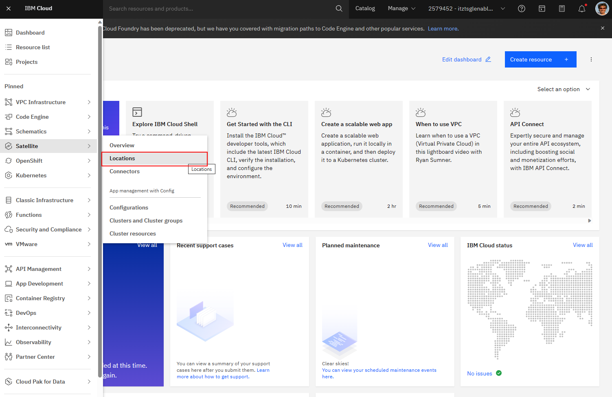
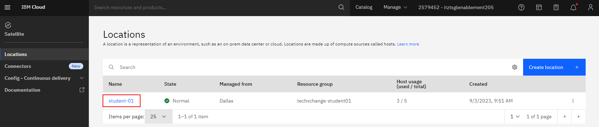
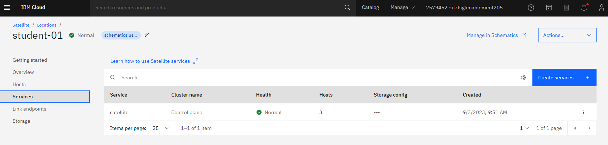
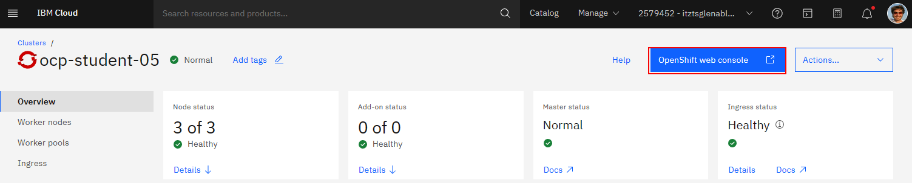

# IBM Cloud TechXchange 2023 : IBM Cloud Satellite Lab 


Lab  | Description
---|---
[Lab 1](#Lab-1) | Deploying Red Hat Open Shift in Satellite Location
[Lab 2](#Lab-2) | Day Two Operational Tools and Deploy Sample Application

---

<br>

<br>

---

# Lab 1

## Deploy Red Hat OpenShift on Satellite Location

In this lab you will be building a Red Hat OpenShift Cluster running in a Satellite Location. The Satellite Location service and a Satellite Control Plane have already been configured that will be used in this lab to deploy additional cloud services. In this Satellite location, you will have two virtual machines dedicated to you that will be utilized as workers for the Red Hat OpenShift cluster that you will be provisioning. These hosts have already been attached to the Satellite location.

### Log in to the IBM Cloud console

For this environment you will use a custom login screen to login to the IBM Cloud console. Please follow the link below and use the credentials provided to you by the instructors. The link to the custom IBM Cloud Login screen can also be found in the bookmark bar of the browser on your computer.

[IBM Cloud console login](https://cloud.ibm.com/authorize/techxchange23satellite)


When you login, you will land on the dashboard screen for the account. From here you will want to navigate to the Satellite Locations screen. Expand the navigation menu by clicking on the top left navigation. Mouse over the Satellite tab, and select Locations from the pop out menu.



On the Locations screen, you will see a location already created with a name of techxchange (or similar). We will use this location. Click this location to navigate to the location detail screen.



Here you will see the details of the current location and should be in a "Normal" state. Review the information on this screen. Make certain that you see "Hosts available" is two, and "Hosts total" is five.

** Please locate an instructor if your location is currently in a different state, or if you do not see the available hosts.


The next step will be to start to deploy a new service to the Satellite location. From the left navigation, click Services. Here you will see the Satellite service with a cluster name "Control plane". This is the control plane previously created by the lab instructors. In addition to being the control plane for the Satellite lcoation, the control plane hosts will be used as the master nodes for the Red Hat OpenShift cluster you will create.



Click on "Create services" button on the top right of the table. A popout of available services will be displayed. This is a list of the available services that can be currently deployed to a Satellite location. You will click "Red Hat OpenShift on IBM Cloud". A new window should open, and this is where you will start to make the selections to provision a Red Hat OpenShift on IBM Cloud managed cluster into your Satellite location.


Here you will select the various options to customize your Red Hat OpenShift cluster. We will go through each of these options individually. Please make certain to select the appropriate options and naming conventions, as some of the lab requires this consistency.

By default, "Custom cluster" should be selected. You will leave this option selected.


For Infrastructure, "Satellite" should be selected by deafault since we came in from the Satellite location Services screen. Leave this option selected.


Location section, you will need to select the correct resource group. Select the "techxchange-studentXX" resource group, with XX being your assigned student number.

Make certain the Satellite location is selected by the radio button. This should be the only location, and selected by default.


Infrastructure topology, this section should be greyed out, as our hosts are RHEL 8 servers and high availability is created by default.


Default worker pool: Host operating system for these hosts are RHEL 8. This option should be selected by default. 

You will only be using two hosts to provision your cluster, one in zone 1 and zone 2. Uncheck the third zone.

Each host is also configured with 4 vCPUs and 16GB memory. You will leave the worker pool options as default. You should have 4 vCPU selected and 16 GB memory. Only 1 worker per zone. 


### ** IMPORTANT:
Enter the below host label, replacing the number with your student number. This will be used to look for available hosts in the account to use for the workers. If the host labels do not match, a cluster cannot be provisioned.


If you see the below error message when entering or completing adding the worker pool host label, you may need to uncheck the third zone from the worker pool options above again.


OpenShift version: we can leave the default recommended version that is set by default.


OpenShift Container Platform (OCP) license: leave "Purchase additional licenses for this cluster" selected.


Satellite Config: Select "Enable cluster admin access for Staellite Config"


We will leave the Ingress and Encryption options off by default.


Under Cluster details, enter a name for your cluster, including your student number. Preferably use the format in the example, as some later CLI commands use this format and can make it easier to paste.
### ie: ocp-student1


You can now click the "Create" button in the bottom right.

If you do not receive any errors, you should then be redirected to a screen that looks like the one below.


During this time, we will let the cluster go through the provisioning process and rejoin back to the lab upon completion.

<br>

<br>

----

<br>

----

# *** BREAK FOR PRESENTATION BY INSTRUCTORS ***

<br>

----

<br>

<br>

<br>

## Check the status of your Red Hat OpenShift cluster

At this point you should have a healthy Red Hat OpenShift cluster running in the Satellite location. Check the status of your cluster on the cluster detail page. If your cluster shows that your "Ingress status" is in "Critical" state, you may need to wait a few more moments for it to become "Healthy".

Exmaple: Red Hat OpenShift cluster Ingress in Critical Status


Exmaple: Red Hat OpenShift cluster Ingress in Healthy Status


## Publicly expose the cluster

The Red Hat OpenShift console can be accessed via the private network only. You will now take steps to adjust the cluster configuration to allow for the console service to be accessed by the public IPs.

From the IBM Cloud Console, open the IBM Cloud Shell by clicking the Cloud Shell icon in the top right.


Now you should see the IBM Cloud Shell interface. Your session is automatically configured and authenticated with your student IAM account. You can now issue both IBM Cloud CLI and Red Hat OpenShift (oc) CLI commands.


Take note of the region in which your session is running in the output of the Cloud Shell. Switch to the appropriate region if required.

### IMPORTANT
```sh
# ONLY Students 1-10 use region us-south
ibmcloud target -r us-south
```
```sh
# ONLY Students 11-20 use region us-east
ibmcloud target -r us-east
```
```sh
# Target student resource group (replace 0 with student number ie: techxchange-student1)
ibmcloud target -g techxchange-student0
```

<br>

In the following block of code, you will capture the public IPs of the control plane nodes. We will need to set the Satellite location DNS to use these IPs.
```sh
# Get student location
LOCATION=$(ibmcloud sat location ls | grep student-[0-9] | awk '{print $1}')
CPIP1=$(ibmcloud is instances | grep student[0-9]*-controlplane-1 | awk '{print $5}')
CPIP2=$(ibmcloud is instances | grep student[0-9]*-controlplane-2 | awk '{print $5}')
CPIP3=$(ibmcloud is instances | grep student[0-9]*-controlplane-3 | awk '{print $5}')

# Set the Satellite location DNS
ibmcloud sat location dns register --location $LOCATION --ip $CPIP1 --ip $CPIP2 --ip $CPIP3

```

In the following block of code, you will capture the private and public IPs of the worker nodes. You will then replace the IPs for the Network Load Balancer DNS that exposes the cluster UI. * Note: You may need to alter the command below to match your cluster name if you did not name it with the suggested name format earlier.

```sh
# Get the private IPs for the worker nodes of the OpenShift cluster
OLDIP1=$(ibmcloud is instances | grep student[0-9]*-worker-1 | awk '{print $4}')
OLDIP2=$(ibmcloud is instances | grep student[0-9]*-worker-2 | awk '{print $4}')

# Get the public IPs for the worker nodes of the OpenShift cluster
NEWIP1=$(ibmcloud is instances | grep student[0-9]*-worker-1 | awk '{print $5}')
NEWIP2=$(ibmcloud is instances | grep student[0-9]*-worker-2 | awk '{print $5}')

# Get the OpenShift cluster ID and the Load Balancer Hostname and set to environment variables
CLUSTERID=$(ibmcloud oc clusters | grep ocp-student[0-9]* | awk '{print $2}')
NLBHOST=$(ibmcloud oc nlb-dns ls --cluster $CLUSTERID | grep ocp-student[0-9]* | awk '{print $1}')

# Add the NEW Public IPs to the NLB DNS
ibmcloud oc nlb-dns add --cluster $CLUSTERID --nlb-host $NLBHOST --ip $NEWIP1
ibmcloud oc nlb-dns add --cluster $CLUSTERID --nlb-host $NLBHOST --ip $NEWIP2

# Remove the OLD Private IPs from the NLB DNS
ibmcloud oc nlb-dns rm classic --cluster $CLUSTERID --nlb-host $NLBHOST --ip $OLDIP1
ibmcloud oc nlb-dns rm classic --cluster $CLUSTERID --nlb-host $NLBHOST --ip $OLDIP2

# Verify the OCP Cluster DNS is now configured for public access
ibmcloud oc nlb-dns ls --cluster $CLUSTERID

```

Now you can test the openshift console. Click the "OpenShift web console" button. You may need to wait a few minutes for the DNS TTL to lapse. This may take up to 10 minutes.


If successful, you should now be logged into the Red Hat OpenShift on IBM Cloud cluster.


<br>

----

<br>

# ********* LAB 1 COMPLETED *********

<br>

<br>

<br>

<br>

<br>

<br>

<br>

<br>

<br>

<br>

<br>

<br>

<br>

<br>

# Lab 2

## Setup Day two operational tools and deploy sample application

In this lab you will be configuring IBM Cloud Logging and IBM Cloud Monitoring on the OpenShift cluster. You will perform various steps on the command line. You can use the IBM Cloud Shell to issue the IBM Cloud and OpenShift CLI commands in this lab. You will need to first get a Red Hat OpenShift login command from your cluster to login via the CLI.

Alternatively you can also use an IBM Cloud CLI command to login to your cluster. Both steps are listed below, you only need to pick one process.

### Login command via OpenShift Cluster UI

Access your cluster in the IBM Console by selecting OpenShift -> Clusters in the Menu. You should then see your cluster listed. 


Click your cluster to go to the cluster detail screen.


On the cluster detail screen, you will see a button on the top right, "OpenShift web console". Click this button.



You will now automatically be logged into your Red Hat OpenShift cluster via the IBM IAM credentials for your student account. You will see in the top right of this screen, your IAM name. Click this to open the menu, then select "Copy login command".


On this screen, all that you will see is "Display Token". Click this link to display the OpenShift login information.

Copy the "Log in with this token" command.


Go back to the IBM Cloud Console and Open the IBM Cloud Shell by clicking the Cloud Shell icon in the top right.


Now you should see the IBM Cloud Shell interface. Your session is automatically configured and authenticated with your student IAM account. You can now issue both IBM Cloud CLI and Red Hat OpenShift (oc) CLI commands.


In the IBM Cloud Shell, paste the Red Hat OpenShift login command you copied previously and execute. You will then be authenticated to your cluster.

```sh
#Example - DO NOT USE
oc login --token=abcdefgHIJK0123456 --server=https://abcdefgHIJK0123456-ce00.us-south.satellite.appdomain.cloud:31393
```

Again, Alternatively, you could set your cluster context for the OpenShift CLI by getting config details for your cluster via the IBM Cloud CLI. This step is optional if you already followed the process above to login to your cluster for the CLI. This can alternatively be used later.

```sh
CLUSTER=$(ibmcloud oc clusters | grep ocp-student[0-9]* | awk '{print $1}')
ibmcloud oc cluster config --cluster $CLUSTER --admin

```

<br>

### Install IBM Cloud Monitoring agent to the cluster

The first step, you will need to create a secret in your cluster for the docker registry. Execute the command below in the IBM Cloud Shell.
```sh
oc -n default create secret docker-registry all-icr-io --docker-username=ibmapikey --docker-password=all-icr-io
```

```sh
# Set the INGESTKEY variable for region instance
# ONLY Students 1-10 use region us-south
REGION=us-south
INGESTKEY="<TO BE PROVIDED>"

# ONLY Students 11-20 use region us-south
REGION=us-east
INGESTKEY="<TO BE PROVIDED>"
```

```sh
# Install the agent
curl -sL https://ibm.biz/install-sysdig-k8s-agent | bash -s -- -a $INGESTKEY -c ingest.$REGION.monitoring.cloud.ibm.com -ac 'sysdig_capture_enabled: false' --openshift
```

After executing the install script, check the status of the pods. Wait for the pods to go to "READY" status.
```sh
oc get pods -n ibm-observe
```


### Install IBM Cloud Logging Agent to the cluster

In the following steps, you will be deploying the logging agent to your cluster. The steps taken are below for informational, and the commands you need to run are available as well. The agent key is specific to the shared logging instance of this account for your region.

Again, the following steps are informational. You can copy and execute the CLI commands to perform the steps.
1. Create a project. A project is a namespace in a cluster.
2. Create the service account logdna-agent in the cluster namespace ibm-observe.
3. Grant the service account access to the Privileged SCC:
4. Add your secret:
5. Install the OpenShift DaemonSet:

```sh
# Set the REGION and AGENTKEY variables

# ONLY Students 1-10 use region us-south
REGION=us-south
AGENTKEY="<TO BE PROVIDED>"

# ONLY Students 11-20 use region us-south
REGION=us-east
AGENTKEY="<TO BE PROVIDED>"
```

```sh
oc project ibm-observe
oc create serviceaccount logdna-agent -n ibm-observe
oc adm policy add-scc-to-user privileged system:serviceaccount:ibm-observe:logdna-agent
oc create secret generic logdna-agent-key --from-literal=logdna-agent-key=$AGENTKEY -n ibm-observe
oc create -f https://assets.$REGION.logging.cloud.ibm.com/clients/logdna-agent/3/agent-resources-openshift.yaml -n ibm-observe
```

After executing the install script, check the status of the pods. Wait for the pods to go to "READY" status.
```sh
oc get pods -n ibm-observe | grep logdna
```


After you configure a log source, launch the IBM Log Analysis UI by selecting Open dashboard. It may take a few minutes before you start seeing logs.

<br>

## ***** Add steps here for accessing "Observability"

<br>

<br>

# Create Container Registry Pull Secret

To configure Red Hat OpenShift Container Platform to pull from Container Registry, 


Configure Red Hat OpenShift Container Platform to use the image pull secrets by adding the secrets to a service account in each project or by referring to the secret in your pod deployment. You are only required to add the secret to the projects that you want to pull to.

```sh
# Set STUDENT variable for naming, replace 0 with your student number (ie: student1)
STUDENT=student0

# Create a APIKEY for pull secret
REGISTRYAPIKEY=$(ibmcloud iam service-api-key-create techxchange-$STUDENT-registry-key techxchange-registry-id --description "API key for service ID and Red Hat OpenShift on IBM Cloud cluster" | grep 'API Key' | awk '{print $3}')

# Create project
oc new-project techxchange

# Save pull secret to project secrets
oc create secret docker-registry techxchange-docker-registry --docker-server=icr.io --docker-username=iamapikey --docker-password=$REGISTRYAPIKEY --docker-email=student@ibm.edu

# To use this secret for pulling images for Pods, link secret to your service account:
oc secrets link default techxchange-docker-registry --for=pull

```


# Deploy a sample application

Navigate to the Clusters screen


Select your cluster


Click on the "OpenShift web console" button. This will open a new window and automatically authenticate you.


Once you are logged in, switch to the Developer view.


From the developer view, switch to the "techxchange" project. You should have created this project on the CLI from steps prior. If you do not see this project listed, you may need to go back to the previous steps.


On this screen, you should not see any resources. We will now create a new resource by deploying the sample applciation. Click on the "+Add" button in the navigation, or alternatively, the "Add page" link in the middle of the screen.


A sample application image has already been placed in the IBM Cloud Container Registry service in the techxchange2023-satellite namespace for this account. The pull-secret created in the steps previously will be used to authenticate to the registry. Click the option for "Container images".


Enter the below image registry information into the "Image name from external registry" box. Make certain it displays "Validated". If you do not see it "Validated" contact an instructor for help. You may need to verify your pull-secret.

```icr.io/techxchange2023-satellite/endpoints:0.0.1```


All of the rest of the options you can leave as default. Click the "Create" button to deploy the sample application.


You should now see the application deployed and a state similar to the below screenshot. Click on the OpenShift icon in the middle of the deployment to expand a detail window to see more information about the deployment.


You should see the "Pods" in a "Running" state. This will mean you have successfully pulled the image from the registry and deployed the sample application. You should also see a "Route" was created. Click on the link for the Route to see the application.


Clicking the route should have opened a new window/tab in your browser. This sample application will return a JSON result of available endpoints it will respond with.

If you see the beow JSON response, congratulations, you successfully confirmed the running app. Take note of the "/status" endpoint as we will use this for testing. You can now close this window and go back to the OpenShift web console.
```
{"endpoints": [{"route": "/status", "description": "returns a random success or failure. failures result in random 400s or 500s"}, {"route": "/server", "description": "returns hostname of the responding server instance"}, {"route": "/utc", "description": "returns current UTC time"}, {"route": "/fibonacci?n=##", "description": "returns a fibonacci sequence given a number (less than 1000), defaults to 100"}, {"route": "/craps", "description": "rolls 2 die"}, {"route": "/fruits", "description": "list of fruits"}, {"route": "/vegetables", "description": "list of vegetables"}, {"route": "/badbeers", "description": "returns list of least favored beers"}]}
```

Now that you are back in the OpenShift web console, you should still be on the Deployment screen. Click the "copy" button for the Route. We will then go back to an IBM Cloud Shell screen.


Create a variable for "APPROUTE" by pasting the copied ROUTE URL into the cloud shell as below.

```APPROUTE=<route url>```


You should now be able to hit the various endpoints by issuing a curl command in the shell and appending a endpoint from the application.
```sh
# Return a random status
curl -i $APPROUTE/status
```


Enter the below command into the cloud shell and execute. We will leave this running.
```sh
while true;do curl $APPROUTE/status; sleep 1; done
```

<br>

## Logging

In another tab, you may already have open, go back to the IBM Cloud Console. You will now navigate to the "Observability" tab in the menu and select "Logging".


Depending on your region, based on your student number, click the appropriate "Open dashboard" link.


This will log you into the Logging instance that this Satellite location and OpenShift cluster are logging to. You can filter within this dashboard to single out the application we deployed. Click the "Apps" option on top and find the "Endpoints" application, and select it. Then click "Apply".


You should now only see the "Endpoints" application results in the logs. Since you are still running the CLI loop command from previously, you should continue to see new Logs being reported with the "Status" code being returned. You will notice it returns random status codes. You can expand one of the rows of the logs to see further details of the log item.


Logging may stop displaying, if so, make certain "Live" is active. If it is not, you can click on the "Live" button on the bottom right of the screen. Feel free to look at other logs, or move on to the next section.


### Monitoring


Depending on your region, based on your student number, click the appropriate "Open dashboard" link.


This will log you into the Monitoring instance that this Satellite location and OpenShift cluster are sending metrics to.


