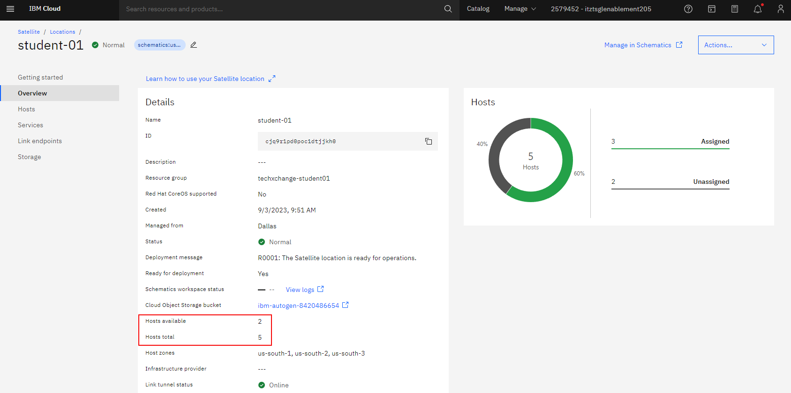
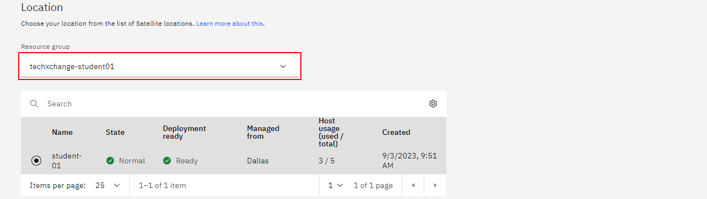
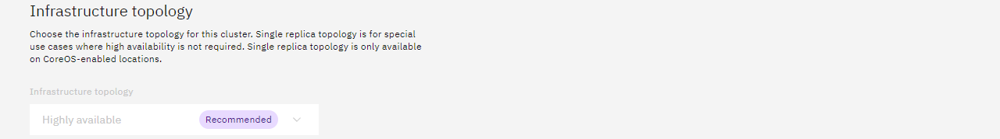
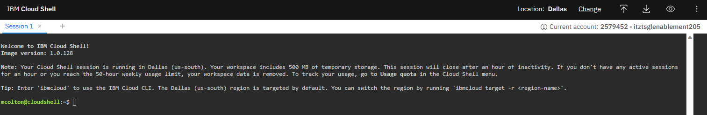
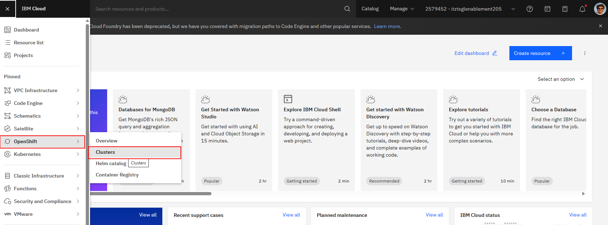
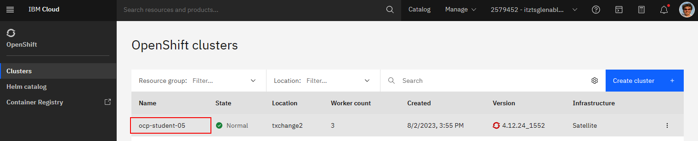
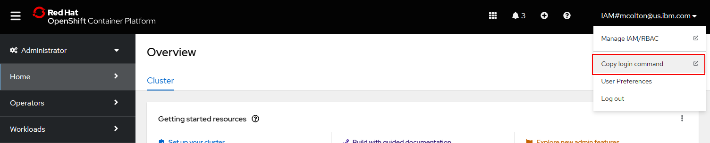

# Lab 1.

## Deploy Red Hat OpenShift on Satellite Location

In this lab you will be building a Red Hat OpenShift Cluster running in a Satellite Location. The Satellite Location service and a Satellite Control Plane have already been configured that will be used in this lab to deploy additional cloud services. In this Satellite location, you will have two virtual machines dedicated to you that will be utilized as workers for the Red Hat OpenShift cluster that you will be provisioning. These hosts have already been attached to the Satellite location.

### Log in to the IBM Cloud console

For this environment you will use a custom login screen to login to the IBM Cloud console. Please follow the link below and use the credentials provided to you by the instructors. The link to the custom IBM Cloud Login screen can also be found in the bookmark bar of the browser on your computer.

[IBM Cloud console login](https://cloud.ibm.com/authorize/techxchange23satellite)


When you login, you will land on the dashboard screen for the account. From here you will want to navigate to the Satellite Locations screen. Expand the navigation menu by clicking on the top left navigation. Mouse over the Satellite tab, and select Locations from the pop out menu.


On the Locations screen, you will see a location already created with a name of techxchange (or similar). We will use this location. Click this location to navigate to the location detail screen.


Here you will see the details of the current location and should be in a "Normal" state. Review the information on this screen. Make certain that you see "Hosts available" is two, and "Hosts total" is five.

** Please locate an instructor if your location is currently in a different state, or if you do not see the available hosts.



The next step will be to start to deploy a new service to the Satellite location. From the left navigation, click Services. Here you will see the Satellite service with a cluster name "Control plane". This is the control plane previously created by the lab instructors. In addition to being the control plane for the Satellite lcoation, the control plane hosts will be used as the master nodes for the Red Hat OpenShift cluster you will create.


Click on "Create services" button on the top right of the table. A popout of available services will be displayed. This is a list of the available services that can be currently deployed to a Satellite location. You will click "Red Hat OpenShift on IBM Cloud". A new window should open, and this is where you will start to make the selections to provision a Red Hat OpenShift on IBM Cloud managed cluster into your Satellite location.


Here you will select the various options to customize your Red Hat OpenShift cluster. We will go through each of these options individually. Please make certain to select the appropriate options and naming conventions, as some of the lab requires this consistency.

By default, "Custom cluster" should be selected. You will leave this option selected.


For Infrastructure, "Satellite" should be selected by deafault since we came in from the Satellite location Services screen. Leave this option selected.


Location section, you will need to select the correct resource group. Select the "techxchange-studentXX" resource group, with XX being your assigned student number.

Make certain the Satellite location is selected by the radio button. This should be the only location, and selected by default.



Infrastructure topology, this section should be greyed out, as our hosts are RHEL 8 servers and high availability is created by default.



Default worker pool: Host operating system for these hosts are RHEL 8. This option should be selected by default. 

You will only be using two hosts to provision your cluster, one in zone 1 and zone 2. Uncheck the third zone.

Each host is also configured with 4 vCPUs and 16GB memory. You will leave the worker pool options as default. You should have 4 vCPU selected and 16 GB memory. Only 1 worker per zone. 


### ** IMPORTANT:
Enter the below host label, replacing the number with your student number. This will be used to look for available hosts in the account to use for the workers. If the host labels do not match, a cluster cannot be provisioned.


If you see the below error message when entering or completing adding the worker pool host label, you may need to uncheck the third zone from the worker pool options above again.


OpenShift version: we can leave the default recommended version that is set by default.


OpenShift Container Platform (OCP) license: leave "Purchase additional licenses for this cluster" selected.


Satellite Config: Select "Enable cluster admin access for Staellite Config"


We will leave the Ingress and Encryption options off by default.


Under Cluster details, enter a name for your cluster, including your student number. Preferably use the format in the example, as some later CLI commands use this format and can make it easier to paste.
### ie: ocp-student1


You can now click the "Create" button in the bottom right.

If you do not receive any errors, you should then be redirected to a screen that looks like the one below.


During this time, we will let the cluster go through the provisioning process and rejoin back to the lab upon completion.

<br>

<br>

----

<br>

----

# *** BREAK FOR PRESENTATION BY INSTRUCTORS ***

<br>

----

<br>

<br>

<br>

## Publicly expose the cluster

At this point you should have a healthy Red Hat OpenShift cluster running in the Satellite location. The Red Hat OpenShift console can be accessed via the private network only. You will now take steps to adjust the cluster configuration to allow for the console service to be accessed by the public IPs.

From the IBM Cloud Console, open the IBM Cloud Shell by clicking the Cloud Shell icon in the top right.


Now you should see the IBM Cloud Shell interface. Your session is automatically configured and authenticated with your student IAM account. You can now issue both IBM Cloud CLI and Red Hat OpenShift (oc) CLI commands.



Take note of the region in which your session is running in the output of the Cloud Shell. Switch to the appropriate region if required.

```sh
# Students 1-10 use region us-south
ibmcloud target -r us-south

# Students 11-20 use region us-east
ibmcloud target -r us-east
```

In the following block of code, you will capture the private and public IPs of the worker nodes. You will then replace the IPs for the Network Load Balancer DNS that exposes the cluster UI. * Note: You may need to alter the command below to match your cluster name if you did not name it with the suggested name format earlier.

```sh
# Get the private IPs for the worker nodes of the OpenShift cluster
OLDIP1=$(ibmcloud is instances | grep student[0-9]*-worker-1 | awk '{print $4}')
OLDIP1=$(ibmcloud is instances | grep student[0-9]*-worker-2 | awk '{print $4}')

# Get the public IPs for the worker nodes of the OpenShift cluster
NEWIP1=$(ibmcloud is instances | grep student[0-9]*-worker-1 | awk '{print $5}')
NEWIP2=$(ibmcloud is instances | grep student[0-9]*-worker-2 | awk '{print $5}')

# Get the OpenShift cluster ID and the Load Balancer Hostname and set to environment variables
CLUSTERID=$(ibmcloud oc clusters | grep ocp-student[0-9]* | awk '{print $2}')
NLBHOST=$(ibmcloud oc nlb-dns ls --cluster $CLUSTERID | grep ocp-student[0-9]* | awk '{print $1}')

# Add the NEW Public IPs to the NLB DNS
ibmcloud oc nlb-dns add --cluster $CLUSTERID --nlb-host $NLBHOST --ip $NEWIP1
ibmcloud oc nlb-dns add --cluster $CLUSTERID --nlb-host $NLBHOST --ip $NEWIP2

# Remove the OLD Private IPs from the NLB DNS
ibmcloud oc nlb-dns rm classic --cluster $CLUSTERID --nlb-host $NLBHOST --ip $OLDIP1
ibmcloud oc nlb-dns rm classic --cluster $CLUSTERID --nlb-host $NLBHOST --ip $OLDIP2

# Verify the OCP Cluster DNS is now configured for public access
ibmcloud oc nlb-dns ls --cluster $CLUSTERID
```

Now you can test the openshift console. You may need to wait a few minutes for the DNS TTL to lapse.

<br>

<br>

<br>

----

<br>

----

# *** LAB 1 COMPLETED ***

<br>

----

<br>

<br>

<br>

# Lab 2. Setup Day two operational tools and deploy sample application

In this lab you will be configuring IBM Cloud Logging and IBM Cloud Monitoring on the OpenShift cluster. You will perform various steps on the command line. You can use the IBM Cloud Shell to issue the IBM Cloud and OpenShift CLI commands in this lab. You will need to first get a Red Hat OpenShift login command from your cluster to login via the CLI.

Alternatively you can also use an IBM Cloud CLI command to login to your cluster. Both steps are listed below, you only need to pick one process.

### Login command via OpenShift Cluster UI

Access your cluster in the IBM Console by selecting OpenShift -> Clusters in the Menu. You should then see your cluster listed. 



Click your cluster to go to the cluster detail screen.



On the cluster detail screen, you will see a button on the top right, "OpenShift web console". Click this button.


You will now automatically be logged into your Red Hat OpenShift cluster via the IBM IAM credentials for your student account. You will see in the top right of this screen, your IAM name. Click this to open the menu, then select "Copy login command".



On this screen, all that you will see is "Display Token". Click this link to display the OpenShift login information.

Copy the "Log in with this token" command.


Go back to the IBM Cloud Console and Open the IBM Cloud Shell by clicking the Cloud Shell icon in the top right.


Now you should see the IBM Cloud Shell interface. Your session is automatically configured and authenticated with your student IAM account. You can now issue both IBM Cloud CLI and Red Hat OpenShift (oc) CLI commands.


In the IBM Cloud Shell, paste the Red Hat OpenShift login command you copied previously and execute. You will then be authenticated to your cluster.

Again, Alternatively, you could set your cluster context for the OpenShift CLI by getting config details for your cluster via the IBM Cloud CLI. This step is optional if you already followed the process above to login to your cluster for the CLI.

```sh
ibmcloud oc cluster config --cluster <clustername> --admin
```

<br>

### Install IBM Cloud Monitoring agent to the cluster

The first step, you will need to create a secret in your cluster for the docker registry. Execute the command below in the IBM Cloud Shell.
```sh
oc -n default create secret docker-registry all-icr-io --docker-username=ibmapikey --docker-password=all-icr-io
```

```sh
curl -sL https://ibm.biz/install-sysdig-k8s-agent | bash -s -- -a 42db7192-63b3-4e83-82d0-ba72c6451836 -c ingest.us-south.monitoring.cloud.ibm.com -ac 'sysdig_capture_enabled: false' --openshift
```

### Install IBM Cloud Logging Agent to the cluster

In the following steps, you will be deploying the logging agent to your cluster. The steps taken are below for informational, and the commands you need to run are available as well. The agent key is specific to the shared loggin instance of this account.

[Setup Logging on OpenShift Cluster](https://cloud.ibm.com/observe/logging/14a8260d-7fd8-42a6-b7fa-db27af9fc223/sources)

1. Create a project. A project is a namespace in a cluster.

2. Create the service account logdna-agent in the cluster namespace ibm-observe.

3. Grant the service account access to the Privileged SCC:

4. Add your secret:

5. Install the OpenShift DaemonSet:

```sh
AGENTKEY=730820dfbfead0b294225b418bba680a
oc adm new-project --node-selector='' ibm-observe
oc create serviceaccount logdna-agent -n ibm-observe
oc adm policy add-scc-to-user privileged system:serviceaccount:ibm-observe:logdna-agent
oc create secret generic logdna-agent-key --from-literal=logdna-agent-key=$AGENTKEY -n ibm-observe
oc create -f https://assets.us-east.logging.cloud.ibm.com/clients/logdna-agent/3/agent-resources-openshift.yaml -n ibm-observe
```

After you configure a log source, launch the IBM Log Analysis UI by selecting Open dashboard. It may take a few minutes before you start seeing logs.


# Create Container Registry Pull Secret

To configure Red Hat OpenShift Container Platform to pull from Container Registry, 


Configure Red Hat OpenShift Container Platform to use the image pull secrets by adding the secrets to a service account in each project or by referring to the secret in your pod deployment. You are only required to add the secret to the projects that you want to pull to.

**********
ibmcloud iam service-id-create techxchange-registry-id --description "Service ID for IBM Cloud Container Registry and Red Hat OpenShift on IBM Cloud"


ibmcloud iam service-policy-create ServiceId-d597fefb-f2f5-4d04-b172-39b86cc803e4 --roles Manager --service-name container-registry --region global --resource-type namespace --resource techxchange2023-satellite


ibmcloud iam service-api-key-create techxchange-registry-key techxchange-registry-id --description "API key for service ID and Red Hat OpenShift on IBM Cloud cluster"

WbHJo4t6Qxbz1RAcbQRA7BBeMi8oXqTJ6LoFAeAlQ32X

oc --namespace default create secret docker-registry techxchange-docker-registry --docker-server=icr.io --docker-username=iamapikey --docker-password=WbHJo4t6Qxbz1RAcbQRA7BBeMi8oXqTJ6LoFAeAlQ32X --docker-email=student@ibm.edu
******************

ibmcloud iam service-api-key-create techxchange-registry-key techxchange-registry-id --description "API key for service ID and Red Hat OpenShift on IBM Cloud cluster"

(maybe do this in the UI when deployign the app?)

oc --namespace $APPNAMESPACE create secret docker-registry techxchange-docker-registry --docker-server=icr.io --docker-username=iamapikey --docker-password=$REGISTRYAPIKEY --docker-email=student@ibm.edu


# Deploy a sample application

### Need to patch registry if not managed

ibmcloud oc cluster config --cluster <cluster> -- admin

Remove: oc patch configs.imageregistry.operator.openshift.io cluster --type merge --patch '{"spec":{"managementState":"Managed"}}'


icr.io/techxchange2023-satellite/endpoints:0.0.1


