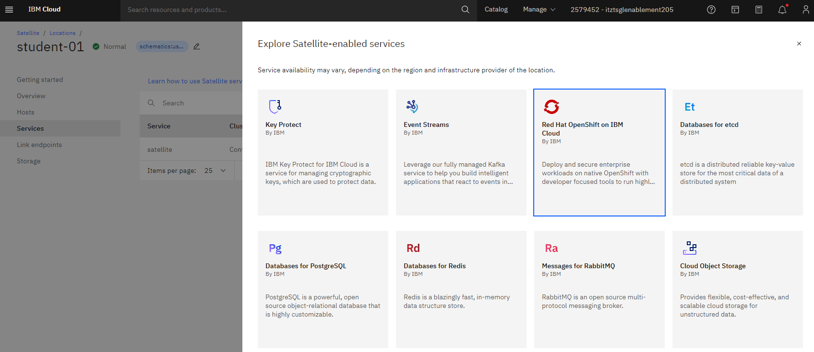
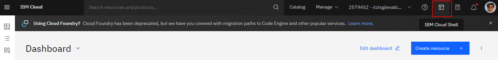

# Lab 1.

## Deploy Red Hat OpenShift on Satellite Location

In this lab you will be building a Red Hat OpenShift Cluster running in a Satellite Location. A Satellite Location service and a Satellite Control Plane has already been configured that will be used in this lab to deploy additional cloud services. In this Satellite location, you will have three virtual machines dedicated to you that will be utilized as workers for the Red Hat OpenShift cluster that you will be provisioning.

### Log in to the IBM Cloud console

For this environment you will use a custom login screen to login to the IBM Cloud console. Please follow the link below and use the credentials provided to you by the instructors. The link to the custom IBM Cloud Login screen can also be found in the bookmark bar of the browser on your computer.

[IBM Cloud console login](https://cloud.ibm.com/authorize/techxchange23satellite)


When you login, you will land on the dashboard screen. From here we will want to navigate to the Satellite Locations screen. Expand the navigation menu by clicking on the top left navigation. Mouse over the Satellite tab, and select Locations from the pop out menu.


On the Locations screen, you will see a location already created with a name of techxchange (or similar). We will use this location. Click this location to navigate to the location detail screen.


Here you will see the details of the current location and should be in a Normal state. Everyone in this lab will be sharing this location, so you will see many hosts attached to this location, however you will only need two hosts.


The next step will be to start to deploy a new service to the Satellite location. From the left navigation, click Services. Here you will see the Satellite service with a cluster name "Control plane". This is the control plane previously created by the lab instructors. This control plane will be used as the master nodes for the Red Hat OpenShift cluster you will create.


Click on "Create services" and a popout of available services will be displayed. Choose "Red Hat OpenShift on IBM Cloud"



Here you will select the various options to customize your Red hat OpenShift cluster.


Choose Custom Cluster (default)

Infrastructure
Choose Satellite
Location


Resource Group select "techxchange-studentXX" with XX being your student number.

Make certain the location is selected.

Default worker pool


Leave host operating system as RHEL 8

Worker pool zones
uncheck "us-east-3", since we are choosing to only deploy two workers.

vCPUs should be 4
Memory should be 16
Worker nodes per zone leave as 1

---

**IMPORTANT**
Default worker pool host labels
student:XX (XX = student #)

OpenShift version
choose 4.12.XX


OpenShift Container Platform (OCP) license
leave as Purchase additional licenses for this cluster

Satellite Config
Select "Enable cluster admin access for Staellite Config"

We will leave the Ingress and Encryption options off by default.

Under Cluster details, enter a name for your cluster, including your student number
ie: ocp-student00

We can now click "Create".

If you do not receive any errors, we are now done with this portion of the lab.

During this time, we will let the cluster go through the provisioning process and rejoin back to the lab upon completion.

<br>

<br>

<br>

----

<br>

----

# *** BREAK FOR PRESENTATION BY INSTRUCTORS ***

<br>

----

<br>

<br>

<br>

## Publicly expose the cluster

At this point you should have a healthy running Red Hat OpenShift cluster running in the Satellite location. We will now take steps to adjust the workers to allow for the console service to be running on public IPs so we can gain access to the console.

* Add steps

Get Floating IPs

Cloud Shell

Switch region if needed

```sh
ibmcloud target -r us-south
```

Get a list of the virtual servers and save floating IPs

```sh
ibmcloud is instances
```

```sh
NEWIP1=<1st ip>
NEWIP2=<2nd ip>
```


Get a list of clusters

```sh
ibmcloud oc clusters
```

Set the ClusterID to a environment variable

```sh
CLUSTERID=<clusterid>
```

Capture the Cluster NLB DNS Hostname, and save each of the existing IPs

```sh
ibmcloud oc nlb-dns ls --cluster $CLUSTERID
NLBHOST=<nlbhost>
OLDIP1=<1st ip>
OLDIP2=<2nd ip>
```


Add the NEW IPs to the NLB DNS

```sh
ibmcloud oc nlb-dns add --cluster $CLUSTERID --nlb-host $NLBHOST --ip $NEWIP1
ibmcloud oc nlb-dns add --cluster $CLUSTERID --nlb-host $NLBHOST --ip $NEWIP2
```

Remove the OLD IPs from the NLB DNS

```sh
ibmcloud oc nlb-dns rm classic --cluster $CLUSTERID --nlb-host $NLBHOST --ip $OLDIP1
ibmcloud oc nlb-dns rm classic --cluster $CLUSTERID --nlb-host $NLBHOST --ip $OLDIP2
```


Now you can test the openshift console. You may need to wait a few minutes for the DNS TTL to lapse.

<br>

<br>

<br>

----

<br>

----

# *** LAB 1 COMPLETED ***

<br>

----

<br>

<br>

<br>

# Lab 2. Setup logging

### In this lab we will be configuring IBM Cloud Logging on the OpenShift cluster. We can open the IBM Cloud Shell to issue the OpenShift CLI commands. We will need to first get a login command.


Click Display Token

Copy Login Command


Go back to the IBM Cloud Console and Open the IBM Cloud Shell, on the top right.



In the following steps, you will be deploying the logging agent to your cluster. The steps taken are below for informational, and the commands you need to run are available as well. The agent key is specific to the shared loggin instance of this account.

[Setup Logging on OpenShift Cluster](https://cloud.ibm.com/observe/logging/14a8260d-7fd8-42a6-b7fa-db27af9fc223/sources)

1. Create a project. A project is a namespace in a cluster.

2. Create the service account logdna-agent in the cluster namespace ibm-observe.

3. Grant the service account access to the Privileged SCC:

4. Add your secret:

5. Install the OpenShift DaemonSet:

```sh
AGENTKEY=730820dfbfead0b294225b418bba680a
oc adm new-project --node-selector='' ibm-observe
oc create serviceaccount logdna-agent -n ibm-observe
oc adm policy add-scc-to-user privileged system:serviceaccount:ibm-observe:logdna-agent
oc create secret generic logdna-agent-key --from-literal=logdna-agent-key=$AGENTKEY -n ibm-observe
oc create -f https://assets.us-east.logging.cloud.ibm.com/clients/logdna-agent/3/agent-resources-openshift.yaml -n ibm-observe
```

After you configure a log source, launch the IBM Log Analysis UI by selecting Open dashboard. It may take a few minutes before you start seeing logs.

# Lab 3. Deploy a sample application

### Need to patch registry if not managed

ibmcloud oc cluster config --cluster <cluster> -- admin
oc patch configs.imageregistry.operator.openshift.io cluster --type merge --patch '{"spec":{"managementState":"Managed"}}'


##
Login to openshift

github link here for repo


